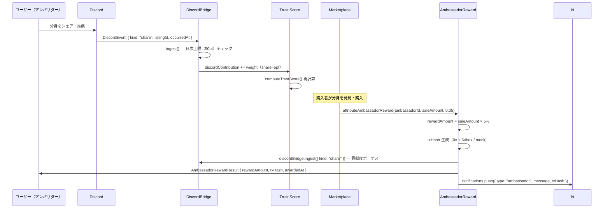

# GUILD AI — Discord Synergy 設計図

## 概要

Discord でのアクション（シェア・推薦・リアクション）が Trust Score に連動し、売上が発生するとスマートコントラクト風の自動報酬分配が走る自走型拡散エコシステム。

---

## シーケンス図（Mermaid）



---

## Discord アクション重み表

| アクション | kind | ポイント | 日次上限 |
|-----------|------|---------|---------|
| 分身をシェア | share | 5 | 50pt/日 |
| 推薦コメント | endorse | 3 | 同上 |
| リアクション | react | 1 | 同上 |
| バグ報告 | bug-report | 4 | 同上 |

実装: `src/lib/discord-bridge/index.ts` の `DISCORD_WEIGHTS` と `DAILY_CAP`

---

## アンバサダー報酬の計算

```typescript
// saleAmount × share (デフォルト 5%)
rewardAmount = Math.round(saleAmount * 0.05);

// mock txHash: 64 hex chars, 決定論的
txHash = "0x" + Array.from({ length: 64 }, (_, i) => {
  return ((seed.charCodeAt(i % seed.length) ^ (i * 31)) & 0xf).toString(16);
}).join("");
```

---

## 通知フロー

```
attributeAmbassadorReward() 実行
  └→ notifications: type="ambassador"
       ├─ title: "アンバサダー報酬を受け取りました"
       ├─ message: "...¥500 を分配しました（tx: 0x1a2b3c...）"
       ├─ txHash: "0x..."
       └─ referredAssetId: "asset-xxx"

/wallet NotificationBell
  └→ getAllNotifications() で ambassador + 通常通知を合算表示
  └→ getAmbassadorNotifications() で ambassador 単独フィルタ可能
```

---

## 関連ファイル

| ファイル | 役割 |
|---------|------|
| `src/lib/discord-bridge/index.ts` | ingest() + attributeAmbassadorReward() |
| `src/lib/notifications/index.ts` | getAmbassadorNotifications() + getAllNotifications() |
| `src/types/index.ts` | NotificationType に "ambassador" 追加 |
| `src/components/NotificationBell.tsx` | /wallet ベル UI |
