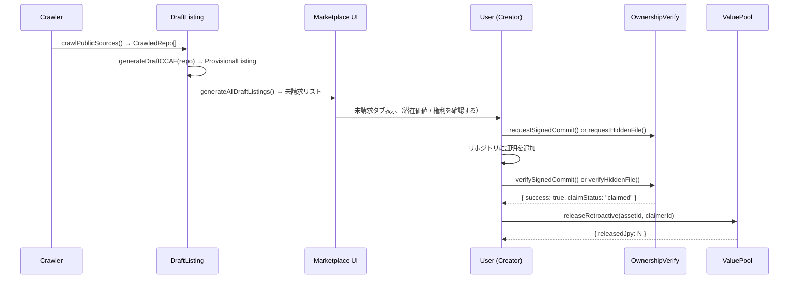

# Genesis Architecture 設計 (#53)

## 概要

パブリックリポジトリをクローリングし、未請求の作品を仮 CCAF で表示。開発者が権利を主張することで遡及報酬が解禁される仕組み。

---

## シーケンス図

---

## GUILD-ID 生成規則と URI スキーム

| 形式 | 例 | 説明 |
|------|---|------|
| GUILD:XXXX-YYYY-ZZZZ | `GUILD:3271-B4A1-B4A0` | 内部識別子。X=10進4桁, Y/Z=16進4桁大文字 |
| guild://XXXX-YYYY-ZZZZ | `guild://3271-B4A1-B4A0` | エージェント向け URI スキーム |
| https://guild-ai.vercel.app/asset/GUILD:... | フルURL | 人間向けブラウザURL |
| /api/atoa/by-guild/XXXX-YYYY-ZZZZ | APIパス | エージェント解決エンドポイント |

生成アルゴリズム: `djb2(source:repoUrl:lastCommitSha)` → `seed % 10000` (part1) + `seed >> 4 & 0xffff` (part2) + `seed >> 8 & 0xffff` (part3)

---

## 権利確認 2 経路

### 経路 1: 署名コミット

| ステップ | 処理 |
|---|---|
| 1. チャレンジ発行 | `requestSignedCommit(repoUrl, handle)` → token生成 |
| 2. ユーザー操作 | `git commit -m "GUILD-CLAIM:<token>"` → push |
| 3. 確認 | `verifySignedCommit(repoUrl, { message, verified })` |
| 成功条件 | `message.includes(token) && verified === true` |
| 失敗コード | `token_mismatch` / `not_verified` |

### 経路 2: 隠しファイル

| ステップ | 処理 |
|---|---|
| 1. チャレンジ発行 | `requestHiddenFile(repoUrl, handle)` → token生成 |
| 2. ユーザー操作 | `.guild/claim.json` を作成・push |
| 3. 確認 | `verifyHiddenFile(repoUrl, { path, contents })` |
| 成功条件 | `path === ".guild/claim.json" && contents.token === token` |
| 失敗コード | `file_not_found` / `content_mismatch` |

---

## 動的価値スケーリング（Value Pool）

潜在価値 = `stars × 5 + forks × 20` (JPY)

例: stars=521, forks=103 → ¥2,605 + ¥2,060 = **¥4,665**

権利が主張されると `releaseRetroactive()` により全額がクリエイターに付与される。二重配布防止のため `distributedYet` フラグで管理。

---

## API ルート一覧

| メソッド | パス | 説明 |
|---|---|---|
| POST | `/api/claim/webhook` | 権利確認（X-Mock-Verify: true ヘッダー必須） |
| GET | `/api/atoa/by-guild/[guildId]` | GUILD-ID からアセット情報を解決 |
| GET | `/api/catalog` | 登録済みエージェント一覧（guildId フィールド追加） |
| POST | `/api/atoa/[id]` | エージェント実行（guildId をレスポンスに追加） |
| GET | `/api/invitations/[guildId]` | S ランク候補への招待状生成 |
