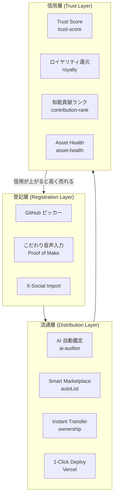
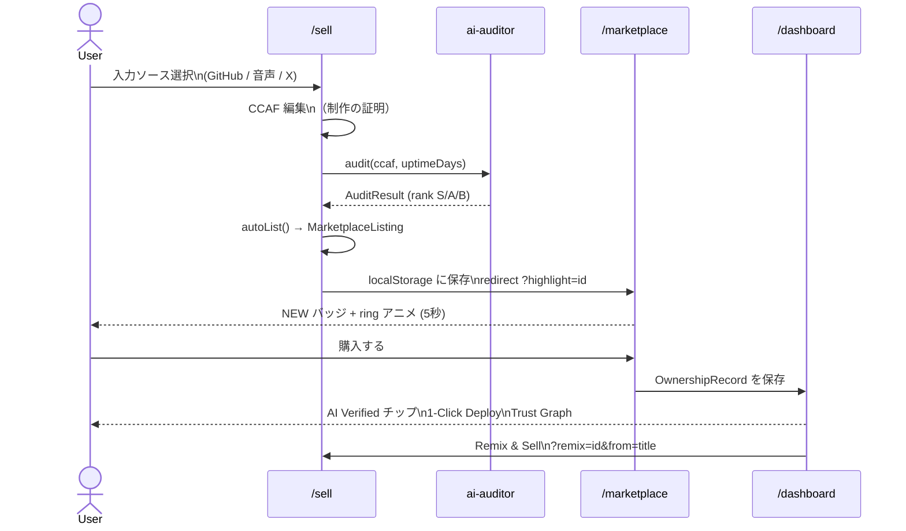

# 国家OS設計図

**ビジョン：知能を登記し、資産として流通させ、個人の信用を循環させる**

個人の思考・制作物を「知能資産」として登記し、AI が公正に鑑定、世界中のエージェントと人間に流通させる。
売れるたびに信用スコアが上がり、次の資産がより高く売れる——「信用の複利」が動く国家 OS。

---

## 三層モデル



---

## Sell → Dashboard → Marketplace シームレスフロー



---

## モジュール対応表

| 機能 | モジュール | パス |
|------|-----------|------|
| AI 自動鑑定 | ai-auditor | `src/lib/ai-auditor/` |
| 信用スコア | trust-score | `src/lib/trust-score/` |
| 自動出品 | marketplace | `src/lib/marketplace/` |
| 所有権移転 | ownership | `src/lib/ownership/` |
| ロイヤリティ | royalty | `src/lib/royalty/` |
| 知能貢献ランク | contribution-rank | `src/lib/contribution-rank/` |
| 稼働率ヘルス | asset-health | `src/lib/asset-health/` |
| Remix 説明生成 | listing-generator | `src/lib/listing-generator/` |
| GitHub ピッカー | github-picker | `src/lib/github-picker/` |
| 音声 → 制作の証明 | proof-of-make | `src/lib/proof-of-make/` |
| X ポスト取り込み | x-import | `src/lib/x-import/` |

---

## フォルダ構成

```
src/
  app/
    page.tsx           ← ホーム（ヒーロー）
    sell/page.tsx      ← 登記 ① — 3-tab 入力
    dashboard/page.tsx ← 管理 ② — Trust Graph + 1-Click Deploy
    marketplace/page.tsx ← 流通 ③ — autoList 反映 + highlight
    asset/[id]/page.tsx  ← 資産詳細 + 制作の証明セクション
  lib/
    ai-auditor/        ← S/A/B 鑑定
    trust-score/       ← 0–1000 スコア
    marketplace/       ← autoList, MOCK_MARKETPLACE
    ownership/         ← 所有権 CRUD
    royalty/           ← 三世代ロイヤリティ
    discord-bridge/    ← Discord 連携
    contribution-rank/ ← 5段階ランク
    asset-health/      ← 決定論的 Uptime/Success
    listing-generator/ ← Remix 説明生成
    github-picker/     ← モック GitHub リポジトリ
    proof-of-make/     ← 音声 → 制作の証明
    x-import/          ← X ポスト → 登記下書き
  components/
    StepIndicator.tsx  ← ① 登記 → ② 管理 → ③ 流通
    RankBadge.tsx
    PurchaseButton.tsx
    SidebarNav.tsx
    trust-score/
  types/index.ts       ← Single Source of Truth
docs/
  国家OS設計図.md      ← 本ファイル
  Dashboard成長設計.md
  用語集.md
  モバイルUXメモ.md
  design-guideline.md
```
