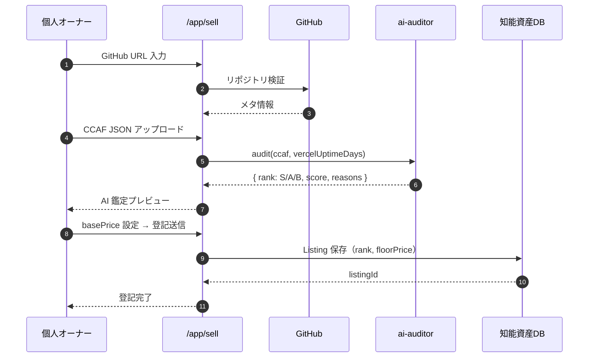
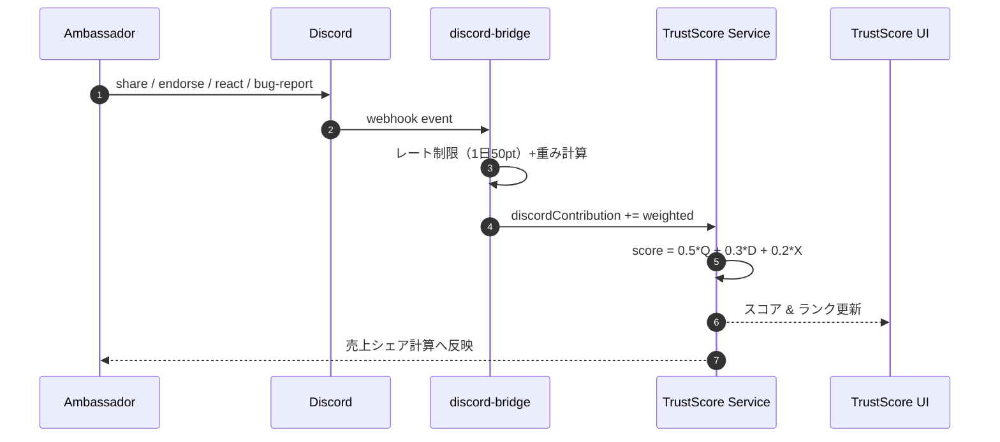
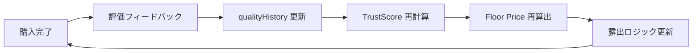
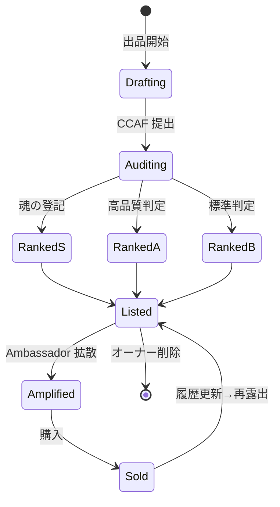

# GUILD AI 業務フロー図

出品 → AI 鑑定 → 登記 → 拡散 → 購入 → 信用反映 の循環を可視化する。

---

## 1. 全体循環フロー（flowchart）

```mermaid
flowchart TD
    A[個人オーナー\n出品開始] --> B[/app/sell\nGitHub URL 入力]
    B --> C[CCAF アップロード\nor 自動生成]
    C --> D[ai-auditor\n思考密度+Vercel稼働解析]
    D -->|S/A/B 判定| E[ランク確定]
    E --> F[Floor Price 自動算出]
    F --> G[登記送信\n知能資産 DB]
    G --> H[Marketplace 公開]
    H --> I[Ambassador が拡散\nDiscord/X]
    I --> J[discord-bridge\nアクション計測]
    J --> K[Trust Score 再計算]
    K --> L{toA / toB / 個人\n購入}
    L --> M[売上配分\nオーナー + Ambassador]
    M --> N[品質履歴 更新]
    N --> K
    K --> F

    classDef soul fill:#E8C46A,stroke:#0F0F12,color:#0F0F12;
    class E,G soul;
```

---

## 2. 出品 → 鑑定 → 登記（sequenceDiagram）



---

## 3. 拡散 → Trust Score 反映（sequenceDiagram）



---

## 4. 購入 → 信用反映ループ（flowchart）



---

## 5. 状態遷移（stateDiagram-v2）


